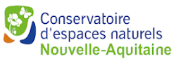
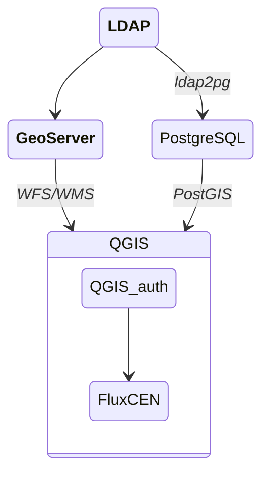

# Exemples de mise en production

## CEN Nouvelle-Aquitaine : LDAP, GeoServer et ldap2pg

Le SIG du CEN Nouvelle-Aquitaine repose en grande partie sur le serveur cartographique **[GeoServer](https://geoserver.org/)**.

Connecté aux bases de données métier, il permet de véhiculer en temps réel des données de qualité pour l'ensemble des salariés mais aussi pour les partenaires extérieurs.

FluxCEN a été développé avec pour objectif de faciliter grandement l'accès aux données confidentielles.

L'idée est d'utiliser un **identifiant compte CEN NA unique** par collaborateur lui permettant de se connecter à toutes les applications mais également aux données protégées issues de GeoServer ainsi qu'aux tables PostGIS dans un objectif d'**édition collaborative**.

 

:material-folder-account-outline: Un **annuaire LDAP** est utilisé pour centraliser tous les identifants.

GeoServer est ensuite configuré pour fonctionner avec les groupes LDAP dédiés (un utilisateur LDAP pouvant être dans plusieurs groupes). Lors de la publication d'une couche dans GeoServer, il suffit alors d'indiquer les privilèges liés au groupe.

!!! info "Exemple"
    Pour accéder aux données protégées liées à l'animation foncière, une espace de travail dans GeoServer est configuré pour aller interroger la base de données de l'application dédiée FoncierCEN.

    L'accès aux couches de cet espace de travail est alors rendu accessible en lecture uniquement aux membres du groupe LDAP "Accès Géoserver avec authentification".

 

Pour utiliser les mêmes identifiants pour l'accès aux tables PostGIS, il faut que les rôles PostgreSQL soit créés en lien avec les identifiants LDAP. 

Comme il est inenvisageable de gérer ça manuellement, l'excellent utilitaire **[ldap2pg](https://github.com/dalibo/ldap2pg)** développé par Dalibo est utilisé. 
Après configuration, il rend automatique la création des rôles et des privilèges liés dans PostgreSQL à partir de l'annuaire LDAP.

 

Il devient alors facile de gérer nominatiement les accès aux bases de données et les privilèges associés (lecture, écriture, supression) avec toujours le même identifiant unique.

On peut résumer le fonctionnement global grâce au schéma suivant :

