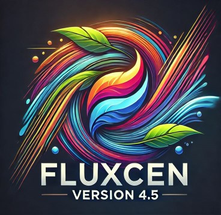

{ align=left }
# =="Un plugin QGIS pour les rassembler tous"==

Le plugin QGIS FluxCEN permet d'accéder rapidement à un large éventail de flux WFS/WMS et de tables PostGIS organisés par catégories et interrogeables sous forme de mots-clés.

Il évite ainsi d'avoir à gérer dans QGIS une multitude de connexions et simplifie grandement l'accès aux données dans un système d'information.

Grâce au lien direct avec le dépôt GitHub, l'ajout et la modification des ressources ne nécessite pas de publier à chaque fois une nouvelle version du plugin.

 

## Fonctionnalités

* :material-note-edit-outline: Centralisation et gestion des ressources dans un fichier .csv au sein de catégories
* :material-layers-search-outline: Recherche rapide des ressources par autocomplétion
* :material-cloud-question-outline: Lien direct vers l'URL de la fiche de métadonnées pour chaque flux
* :material-git: Mise à jour du .csv directement depuis le git indépendamment des versions du plugin
* :material-earth: Prise en charge des flux WFS et WMS (GeoServer et MapServer) avec gestion des styles
* :material-database-marker-outline: Accès direct aux tables de l'extension spatiale PostGIS du SGBD PostgreSQL

## Auteurs
FluxCEN est développé par le service DSI du Conservatoire d'espaces naturels de Nouvelle-Aquitaine

* [Romain MONTILLET](https://github.com/wanderzen91) est le développeur principal du plugin
* [Thomas GACHET](https://github.com/tomgachet) est à l'origine du projet et apporte quelques contributions et idées 